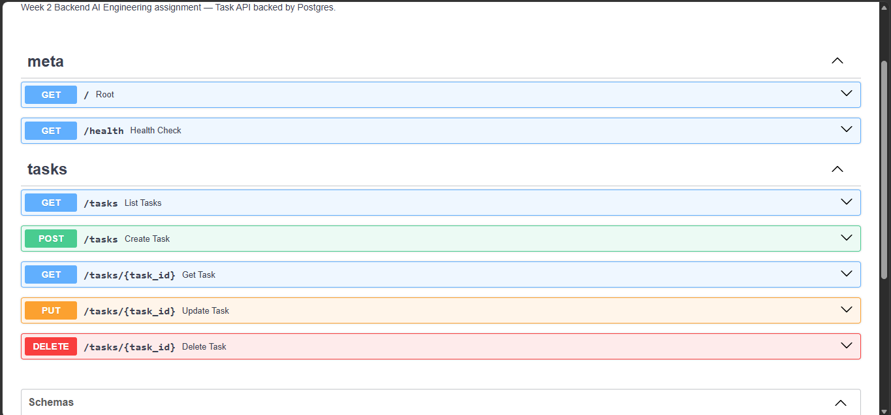

# FlyRank Task API — Containerize Your Stack (BE-04)

Week 2 assignment for the **Backend AI Engineering** track at FlyRank.

A CRUD Task API backed by **Postgres** running in Docker — data survives restarts. App + database start together with one command.

## Stack

- **FastAPI** — Python web framework, auto-generates OpenAPI docs
- **PostgreSQL 16** — database (Docker container with persistent volume)
- **SQLAlchemy 2.0** — ORM for database access
- **Pydantic v2** — request/response validation
- **pytest + httpx** — integration test suite
- **Docker Compose** — runs app + database together

## What changed from Week 1

| File | Week 1 | Week 2 |
|------|--------|--------|
| `app/main.py` | routes | **unchanged** — same routes, same error handling |
| `app/models.py` | Pydantic schemas | **unchanged** |
| `app/exceptions.py` | `TaskNotFoundError` | **unchanged** |
| `app/repository.py` | in-memory `dict` | **rewritten** — same method names (`create`, `get`, `list_all`, `update`, `delete`), now backed by Postgres via SQLAlchemy |
| `app/database.py` | — | **new** — SQLAlchemy engine, session, table definition |
| `app/config.py` | — | **new** — reads `DATABASE_URL` from `.env` |

## Project structure

```
+-- app/
|   +-- __init__.py
|   +-- main.py          # FastAPI app, routes, error handlers
|   +-- models.py        # Pydantic schemas (request/response shapes)
|   +-- repository.py    # Postgres-backed data layer
|   +-- database.py      # SQLAlchemy engine, session, TaskORM table
|   +-- config.py        # Reads DATABASE_URL from .env
|   +-- exceptions.py    # Domain exceptions
+-- tests/
|   +-- __init__.py
|   +-- test_tasks.py    # 13 integration tests
+-- Dockerfile           # Packages the app into a container image
+-- docker-compose.yml   # Runs app + Postgres together
+-- .env.example         # Template (committed, safe)
+-- .env                 # Actual secrets (gitignored)
+-- requirements.txt
+-- README.md
```

## Run it

```bash
# 1. Copy the env template (defaults work out of the box)
cp .env.example .env

# 2. Start everything — Postgres + the app — with one command
docker compose up
```

The app will be live at **http://127.0.0.1:8000**  
Interactive docs (Swagger UI): **http://127.0.0.1:8000/docs**

To stop: `docker compose down` (data persists)  
To wipe the database: `docker compose down -v`

## Endpoints

| Method | Path | Description | Status codes |
|--------|------|-------------|--------------|
| GET | `/` | API metadata | 200 |
| GET | `/health` | Liveness check | 200 |
| POST | `/tasks` | Create a task | 201 Created, 400 Bad Request |
| GET | `/tasks` | List all tasks | 200 OK |
| GET | `/tasks/{id}` | Get a single task | 200 OK, 404 Not Found |
| PUT | `/tasks/{id}` | Update a task | 200 OK, 400 Bad Request, 404 Not Found |
| DELETE | `/tasks/{id}` | Delete a task | 204 No Content, 404 Not Found |

## curl examples

```bash
# Root endpoint
curl -i http://localhost:8000/

# Create a task
curl -i -X POST http://localhost:8000/tasks \
  -H "Content-Type: application/json" \
  -d '{"title":"Buy milk"}'

# List all tasks
curl -i http://localhost:8000/tasks

# Get a single task
curl -i http://localhost:8000/tasks/1

# Update a task
curl -i -X PUT http://localhost:8000/tasks/1 \
  -H "Content-Type: application/json" \
  -d '{"completed":true}'

# Delete a task
curl -i -X DELETE http://localhost:8000/tasks/1

# Missing title → 400
curl -i -X POST http://localhost:8000/tasks \
  -H "Content-Type: application/json" \
  -d '{}'

# Nonexistent task → 404
curl -i http://localhost:8000/tasks/9999
```

## Swagger UI

Open http://127.0.0.1:8000/docs after starting the server to interact with the API visually.



## Proving persistence

Data survives container restarts — verified like this:

```bash
# 1. Start the stack
docker compose up -d

# 2. Create two tasks
curl -s -X POST http://localhost:8000/tasks \
  -H "Content-Type: application/json" \
  -d '{"title":"Task A"}' | jq .
curl -s -X POST http://localhost:8000/tasks \
  -H "Content-Type: application/json" \
  -d '{"title":"Task B"}' | jq .

# 3. Confirm they exist
curl -s http://localhost:8000/tasks | jq .
# → [{"id":1, "title":"Task A", ...}, {"id":2, "title":"Task B", ...}]

# 4. Fully stop the stack (containers removed, volume kept)
docker compose down

# 5. Restart
docker compose up -d

# 6. Tasks are still there — data persisted in the Docker volume
curl -s http://localhost:8000/tasks | jq .
# → [{"id":1, "title":"Task A", ...}, {"id":2, "title":"Task B", ...}]
```

This works because Postgres data lives in a named Docker volume (`flyrank_pgdata`), not inside the container's own filesystem.

## Tests

```bash
docker compose up -d db      # Postgres must be running
pytest -v
```

13 integration tests: root endpoint, health check, full CRUD flow, missing/empty title (400), not-found errors (404), correct status codes on every endpoint.
